# Laboratorio 13: Fragmentación Dinámica, Asignación y Consultas Distribuidas
## P1. Creación de particiones

Creamos la tabla AtencionMedica con la partición por el atributo 'Diagnostico'

``` postgres
CREATE TABLE AtencionMedica (
    DNI CHAR(8),
    CodMedico INTEGER NOT NULL,
    Ciudad VARCHAR(50) NOT NULL,
    Diagnostico VARCHAR(50) NOT NULL,
    Peso DECIMAL(5,2) NOT NULL,
    Talla DECIMAL(4,2) NOT NULL,
    PresionArterial VARCHAR(10) NOT NULL,
    Edad INTEGER NOT NULL CHECK (Edad >= 0),
    FechaAtencion DATE NOT NULL
) PARTITION BY LIST (Diagnostico);
```
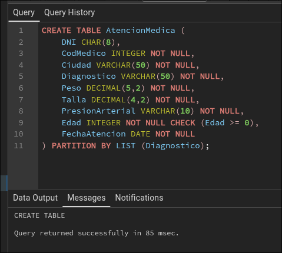

Creamos las particiones por los diferentes tipos de diagnósticos.

``` postgres
CREATE TABLE AtencionMedica_Diabetes                                                     
  PARTITION OF AtencionMedica                                                         
  FOR VALUES IN ('Diabetes');
                                                                              
CREATE TABLE AtencionMedica_Obesidad
    PARTITION OF AtencionMedica                                                          
    FOR VALUES IN ('Obesidad');                                                         

CREATE TABLE AtencionMedica_Cardiopatia                                                  
    PARTITION OF AtencionMedica
    FOR VALUES IN ('Cardiopatía');                                                        
                                                                            
CREATE TABLE AtencionMedica_Hipertension                                                
    PARTITION OF AtencionMedica
    FOR VALUES IN ('Hipertensión');                                                       
```                                     
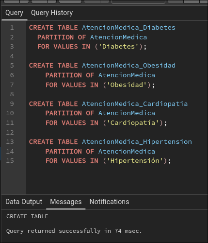

Llenamos la tabla con 60k registros sinteticos:

``` postgres
INSERT INTO AtencionMedica
  (DNI, CodMedico, Ciudad, Diagnostico, Peso, Talla, PresionArterial, Edad, FechaAtencion)                                                                            
SELECT
  LPAD(((random() * 49999)::int + 1)::text, 8, '0')                     AS DNI,         
  (random() * 199 + 1)::int                                             AS CodMedico,   
  (ARRAY['Lima','Callao','Arequipa','Cusco','Trujillo','Piura',                         
		 'Chiclayo','Iquitos','Huancayo','Tacna','Pucallpa','Juliaca',                  
		 'Ica','Ayacucho','Huaraz','Tumbes','Moquegua','Chimbote'])                     
	  [ (random() * 17 + 1)::int ]                                      AS Ciudad,      
  (ARRAY['Diabetes','Obesidad','Cardiopatía','Hipertensión'])                           
	  [ (random() * 3 + 1)::int ]                                       AS Diagnostico, 
  (random() * 60 + 40)::numeric(5,2)                                    AS Peso,                                                                       
  (random() * 0.60 + 1.40)::numeric(4,2)                                AS Talla,                                                            
  ((random() * 60 + 90)::int) || '/' || ((random() * 40 + 60)::int)     AS PresionArterial,                                                   
  (random() * 95)::int                                                  AS Edad,
  DATE '2024-01-01' + ((random() * 730)::int)                           AS FechaAtencion                                                                         
FROM generate_series(1, 60000);                             
```     
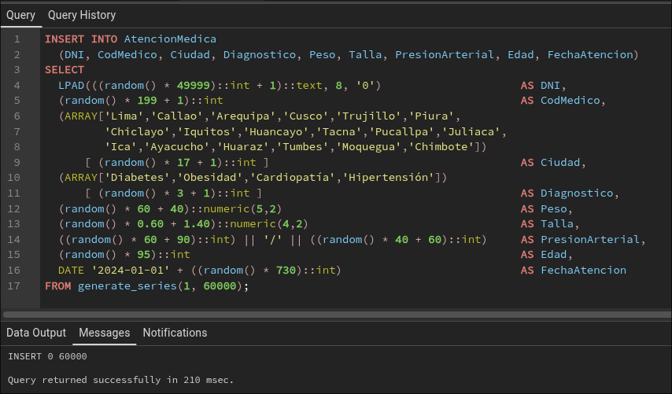

Verificamos:

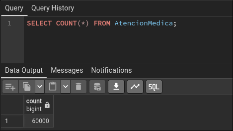


## P2

En esta sección se implementó un mecanismo para que la tabla AtencionMedica pueda crear nuevas particiones automáticamente cuando se registre una atención con un diagnóstico que todavía no cuenta con un fragmento propio.

Inicialmente, la tabla solo posee particiones para Diabetes, Obesidad, Cardiopatía e Hipertensión. Sin embargo, pueden aparecer nuevos diagnósticos durante el registro de atenciones. Por ello, se desarrolló una función auxiliar y un procedimiento almacenado que permiten identificar, crear y reutilizar particiones de forma dinámica.

### Función para normalizar el nombre de las particiones

Primero, se creó la función normalizar_particion. Su objetivo es transformar el nombre de un diagnóstico en un nombre válido para una tabla de PostgreSQL.

La función convierte el texto a minúsculas, elimina tildes y reemplaza espacios o caracteres especiales por guiones bajos. Por ejemplo, un diagnóstico como Insuficiencia Renal se transformaría en insuficiencia_renal. Esto permite generar nombres consistentes para las particiones dinámicas.


``` postgres
CREATE OR REPLACE FUNCTION public.normalizar_particion(p_texto TEXT)
RETURNS TEXT
LANGUAGE sql
IMMUTABLE
AS $$
    SELECT trim(
        both '_' FROM
        regexp_replace(
            translate(lower($1), 'áéíóúüñ', 'aeiouun'),
            '[^a-z0-9]+',
            '_',
            'g'
        )
    );
$$;
```

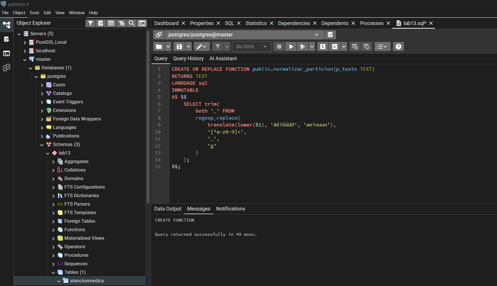

### Procedimiento para insertar atenciones y crear fragmentos

Luego, se implementó el procedimiento almacenado insertar_atencion_dinamica. Este procedimiento recibe todos los datos de una nueva atención médica, incluido el diagnóstico.

Primero, construye el nombre que tendrá la posible partición usando el prefijo atencionmedica_ y la función de normalización. Por ejemplo, para el diagnóstico Asma, el procedimiento genera el nombre atencionmedica_asma.

Después, mediante to_regclass, verifica si ya existe una tabla con dicho nombre. Si no existe, se utiliza SQL dinámico con EXECUTE format(...) para crear una nueva partición de la tabla atencionmedica, asociada exclusivamente a ese diagnóstico.

Finalmente, el procedimiento inserta la atención en la tabla padre. PostgreSQL identifica automáticamente la partición correspondiente y almacena el registro en ella.

``` postgres
CREATE OR REPLACE PROCEDURE public.insertar_atencion_dinamica(
    p_dni CHAR(8),
    p_codmedico INTEGER,
    p_ciudad VARCHAR(50),
    p_diagnostico VARCHAR(50),
    p_peso DECIMAL(5,2),
    p_talla DECIMAL(4,2),
    p_presionarterial VARCHAR(10),
    p_edad INTEGER,
    p_fechaatencion DATE
)
LANGUAGE plpgsql
AS $$
DECLARE
    v_particion TEXT;
BEGIN
    v_particion := 'atencionmedica_' ||
                   public.normalizar_particion(p_diagnostico);

    -- Si no existe una partición física con ese diagnóstico, se crea.
    IF to_regclass(format('public.%I', v_particion)) IS NULL THEN

        EXECUTE format(
            'CREATE TABLE public.%I
             PARTITION OF public.atencionmedica
             FOR VALUES IN (%L)',
            v_particion,
            p_diagnostico
        );

        RAISE NOTICE 'Partición creada dinámicamente: %', v_particion;
    END IF;

    INSERT INTO public.atencionmedica
    (dni, codmedico, ciudad, diagnostico, peso, talla,
     presionarterial, edad, fechaatencion)
    VALUES
    (p_dni, p_codmedico, p_ciudad, p_diagnostico, p_peso, p_talla,
     p_presionarterial, p_edad, p_fechaatencion);
END;
$$;
```

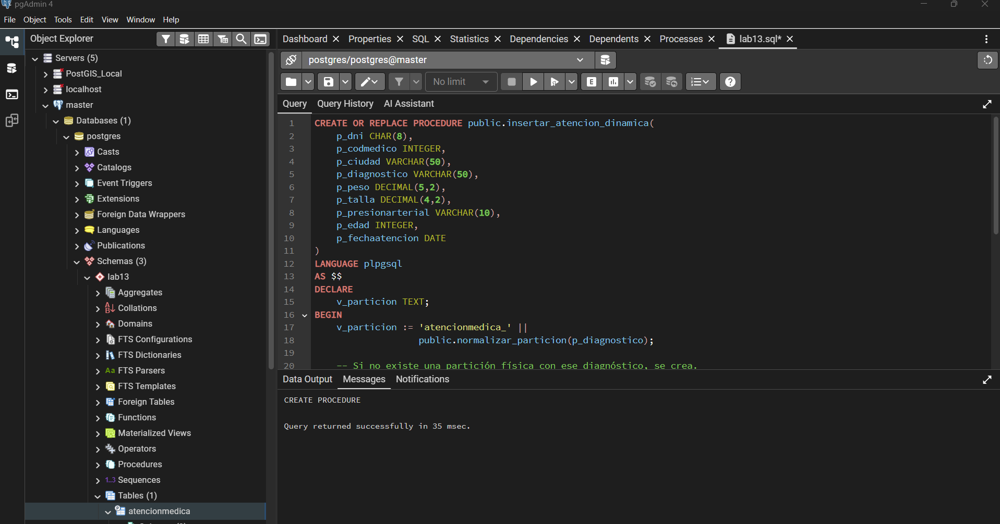

### Inserción de registros con nuevos diagnósticos

Para probar el funcionamiento del procedimiento, se insertaron registros con diagnósticos que no estaban contemplados inicialmente: Asma, Anemia, Gastritis y Dengue.

Al ejecutar los primeros cuatro llamados, el procedimiento detecta que no existen particiones para dichos diagnósticos y crea automáticamente las tablas correspondientes. Posteriormente, se inserta un segundo registro con diagnóstico Asma para comprobar que el procedimiento reutiliza la partición ya creada, sin generar una tabla duplicada.

``` postgres
CALL public.insertar_atencion_dinamica(
    '90000001', 301, 'Arequipa', 'Asma',
    64.00, 1.60, '120/80', 30, DATE '2025-03-01'
);

CALL public.insertar_atencion_dinamica(
    '90000002', 302, 'Cusco', 'Anemia',
    55.00, 1.55, '110/70', 25, DATE '2025-03-02'
);

CALL public.insertar_atencion_dinamica(
    '90000003', 303, 'Piura', 'Gastritis',
    70.00, 1.68, '118/76', 34, DATE '2025-03-03'
);

CALL public.insertar_atencion_dinamica(
    '90000004', 304, 'Trujillo', 'Dengue',
    62.00, 1.64, '115/75', 29, DATE '2025-03-04'
);

-- Reutiliza una partición dinámica ya creada.
CALL public.insertar_atencion_dinamica(
    '90000005', 305, 'Lima', 'Asma',
    68.00, 1.66, '122/78', 32, DATE '2025-03-05'
);
```
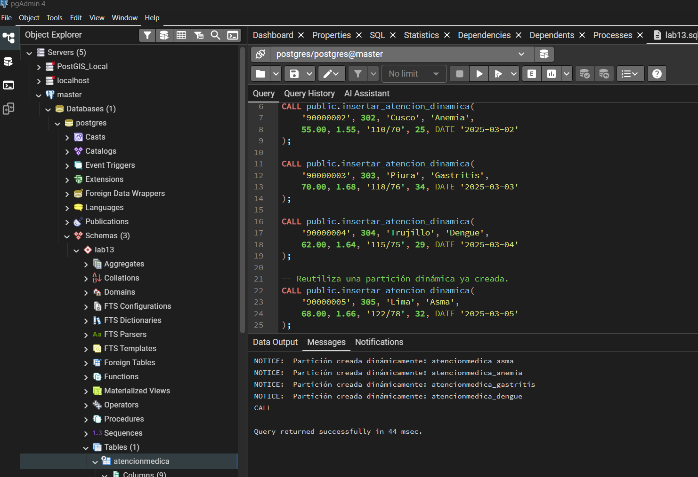


### Verificación de las particiones creadas

Finalmente, se utilizó la columna del sistema tableoid para identificar la tabla física en la que fue almacenado cada registro. La conversión tableoid::regclass permite mostrar directamente el nombre de la partición.


``` postgres
SELECT
    tableoid::regclass AS particion,
    diagnostico,
    COUNT(*) AS registros
FROM public.atencionmedica
WHERE dni IN ('90000001', '90000002', '90000003', '90000004', '90000005')
GROUP BY tableoid::regclass, diagnostico
ORDER BY particion;
```

El resultado evidencia que se crearon las particiones atencionmedica_asma, atencionmedica_anemia, atencionmedica_gastritis y atencionmedica_dengue. Asimismo, la partición atencionmedica_asma contiene dos registros, lo cual confirma que, al insertar nuevamente una atención con un diagnóstico existente, el procedimiento reutiliza la partición creada previamente.

De esta manera, se logra una fragmentación horizontal dinámica, ya que el sistema puede incorporar nuevos diagnósticos sin requerir la creación manual de una partición por parte del administrador.

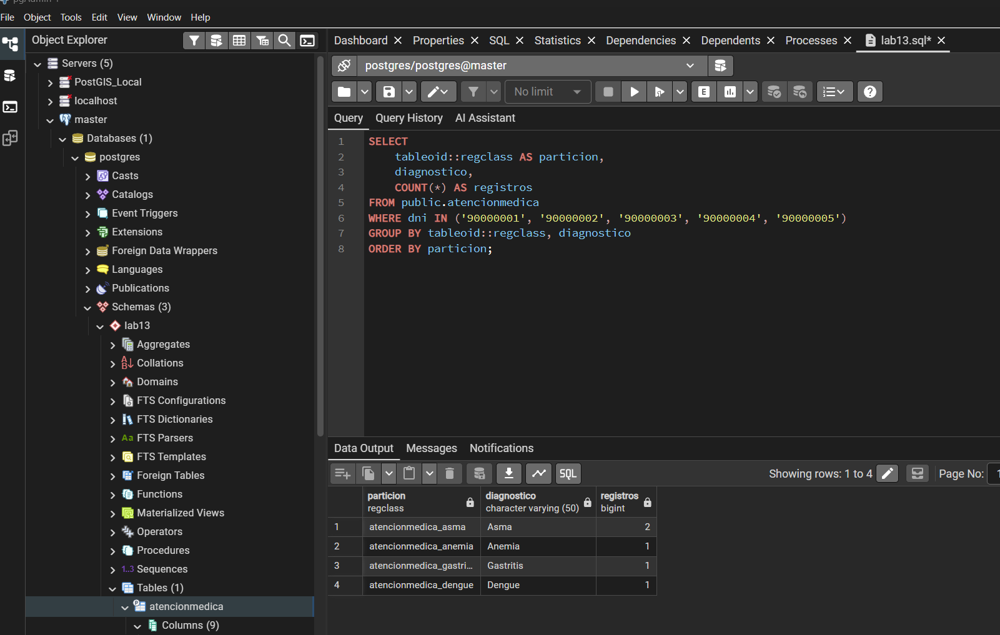

### Investigación: uso de triggers en tablas particionadas

PostgreSQL permite definir triggers sobre tablas particionadas. Cuando se crea un trigger por fila en la tabla padre, PostgreSQL genera triggers equivalentes en las particiones existentes y también en las particiones que se creen posteriormente.

Sin embargo, para este problema no se empleó un trigger como mecanismo principal de creación dinámica de particiones, porque al insertar una fila en una tabla particionada PostgreSQL debe determinar primero la partición destino según el valor de la clave de partición. Si no existe una partición compatible con dicho valor, la inserción produce un error.

Los triggers podrían utilizarse para tareas complementarias, como auditoría, validación de valores o registro de eventos. Sin embargo, en este laboratorio se utilizó un procedimiento almacenado porque permite verificar explícitamente la existencia de la partición antes de ejecutar el `INSERT`.

El procedimiento `insertar_atencion_dinamica` construye el nombre de la partición, verifica su existencia mediante `to_regclass`, la crea dinámicamente con `CREATE TABLE ... PARTITION OF` cuando es necesario y finalmente inserta el registro en la tabla padre. De esta manera, al momento de la inserción PostgreSQL ya dispone de una partición válida para enrutar la atención médica.

#### Prueba de comportamiento de un trigger en una tabla particionada

Para evidenciar este comportamiento, se creó un esquema de prueba independiente, una tabla particionada con una única partición para el diagnóstico `Diabetes`, una tabla de auditoría y un trigger `BEFORE INSERT`.

```postgres
CREATE SCHEMA IF NOT EXISTS prueba_trigger;

CREATE TABLE prueba_trigger.log_trigger (
    id SERIAL PRIMARY KEY,
    diagnostico VARCHAR(50),
    mensaje TEXT,
    fecha TIMESTAMP DEFAULT CURRENT_TIMESTAMP
);

CREATE TABLE prueba_trigger.atencion_demo (
    dni CHAR(8),
    diagnostico VARCHAR(50) NOT NULL
) PARTITION BY LIST (diagnostico);

CREATE TABLE prueba_trigger.atencion_demo_diabetes
PARTITION OF prueba_trigger.atencion_demo
FOR VALUES IN ('Diabetes');

CREATE OR REPLACE FUNCTION prueba_trigger.registrar_trigger()
RETURNS TRIGGER
LANGUAGE plpgsql
AS $$
BEGIN
    INSERT INTO prueba_trigger.log_trigger (
        diagnostico,
        mensaje
    )
    VALUES (
        NEW.diagnostico,
        'El trigger BEFORE INSERT fue ejecutado'
    );

    RETURN NEW;
END;
$$;

CREATE TRIGGER trg_before_insert_demo
BEFORE INSERT ON prueba_trigger.atencion_demo
FOR EACH ROW
EXECUTE FUNCTION prueba_trigger.registrar_trigger();
```

Primero, se insertó un registro con diagnóstico `Diabetes`, para el cual sí existe una partición compatible. Posteriormente, se consultó la tabla de auditoría.

```postgres
INSERT INTO prueba_trigger.atencion_demo
VALUES ('00000001', 'Diabetes');

SELECT *
FROM prueba_trigger.log_trigger;
```

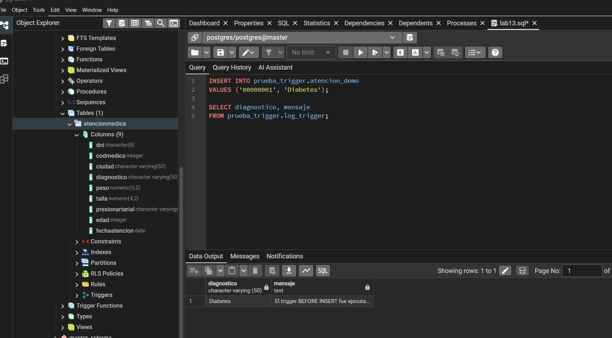

El resultado muestra que el trigger fue ejecutado correctamente, ya que se registró una fila de auditoría para el diagnóstico `Diabetes`. Esto ocurre porque PostgreSQL encontró la partición `atencion_demo_diabetes` y pudo enrutar el registro antes de realizar la inserción.

Luego, se vació la tabla de auditoría y se intentó insertar un diagnóstico que no posee una partición asociada.

```postgres
TRUNCATE TABLE prueba_trigger.log_trigger;

INSERT INTO prueba_trigger.atencion_demo
VALUES ('00000002', 'Asma');
```

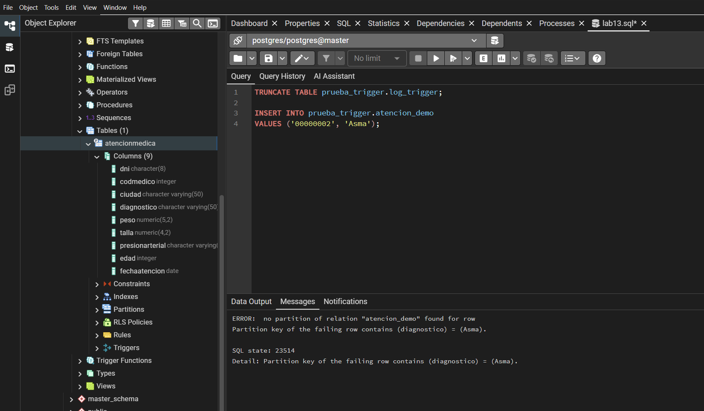

La inserción produjo el error `no partition of relation "atencion_demo" found for row`. El mensaje indica que el valor `Asma` no cuenta con una partición compatible, por lo que PostgreSQL no puede enrutar el registro hacia una tabla física.

Finalmente, se verificó el contenido de la tabla de auditoría después del intento fallido.

```postgres
SELECT *
FROM prueba_trigger.log_trigger;
```

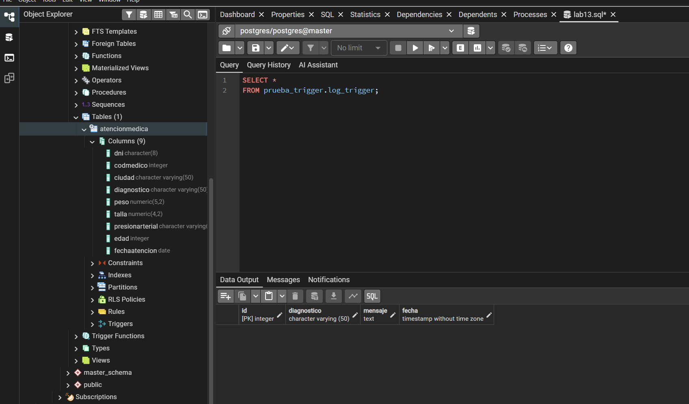

La consulta no devuelve filas, lo cual evidencia que el intento de inserción con `Asma` no llegó a registrar la ejecución del trigger. Por tanto, aunque los triggers pueden utilizarse en tablas particionadas, no constituyen una solución directa para crear una nueva partición cuando todavía no existe un destino válido para la fila.

Por esta razón, el procedimiento `insertar_atencion_dinamica` resulta más adecuado para el laboratorio: primero verifica y crea la partición necesaria, y luego inserta el registro en la tabla padre.


## P3. Asignación distribuida

Para implementar la distribución de fragmentos se creó una red Docker exclusiva denominada `lab12-net`. En esta red se desplegaron tres instancias PostgreSQL: un servidor coordinador denominado `lab12-master` y dos servidores remotos, `lab12-worker1` y `lab12-worker2`.

El servidor master gestiona la tabla particionada y coordina las consultas. Los workers almacenan físicamente fragmentos de la tabla `AtencionMedica`. La comunicación se implementa con `postgres_fdw`, mientras que `dblink` permite crear dinámicamente nuevas tablas en los servidores remotos.

### Creación del entorno Docker

```powershell
docker network create lab12-net
```

```powershell
docker run -d --name lab12-master --network lab12-net -e POSTGRES_PASSWORD=123456 -p 5411:5432 postgres:latest
```

```powershell
docker run -d --name lab12-worker1 --network lab12-net -e POSTGRES_PASSWORD=123456 -p 5412:5432 postgres:latest
```

```powershell
docker run -d --name lab12-worker2 --network lab12-net -e POSTGRES_PASSWORD=123456 -p 5413:5432 postgres:latest
```

Verificamos que los tres contenedores estén activos:

```powershell
docker ps
```

Finalmente, se inspecciona la red para comprobar que los tres servidores comparten la misma subred Docker:

```powershell
docker network inspect lab12-net
```

### Configuración del Worker 1

El primer worker almacenará el fragmento asociado al diagnóstico `Obesidad`.

```powershell
docker exec -it lab12-worker1 psql -U postgres
```

Primero se crea el usuario remoto y la base de datos:

```postgres
CREATE ROLE remote_user LOGIN PASSWORD '123456';

CREATE DATABASE lab12_db;

GRANT CONNECT ON DATABASE lab12_db TO remote_user;
```

Luego se cambia de base de datos. Este comando debe ejecutarse individualmente dentro de `psql`.

```postgres
\c lab12_db
```

Se crea el esquema remoto, la tabla física correspondiente al fragmento de Obesidad y los permisos para el usuario remoto:

```postgres
CREATE SCHEMA IF NOT EXISTS lab12_remote AUTHORIZATION remote_user;

GRANT USAGE, CREATE ON SCHEMA lab12_remote TO remote_user;

CREATE TABLE IF NOT EXISTS lab12_remote.atencionmedica_obesidad (
    dni CHAR(8),
    codmedico INTEGER NOT NULL,
    ciudad VARCHAR(50) NOT NULL,
    diagnostico VARCHAR(50) NOT NULL,
    peso DECIMAL(5,2) NOT NULL,
    talla DECIMAL(4,2) NOT NULL,
    presionarterial VARCHAR(10) NOT NULL,
    edad INTEGER NOT NULL CHECK (edad >= 0),
    fechaatencion DATE NOT NULL
);

GRANT SELECT, INSERT, UPDATE, DELETE
ON TABLE lab12_remote.atencionmedica_obesidad
TO remote_user;
```

### Configuración del Worker 2

El segundo worker almacenará el fragmento asociado al diagnóstico `Hipertensión`.

```powershell
docker exec -it lab12-worker2 psql -U postgres
```

Se crea el usuario remoto y la base de datos:

```postgres
CREATE ROLE remote_user LOGIN PASSWORD '123456';

CREATE DATABASE lab12_db;

GRANT CONNECT ON DATABASE lab12_db TO remote_user;
```

Se cambia de base de datos de manera individual:

```postgres
\c lab12_db
```

Luego se crea el esquema, la tabla física y los permisos:

```postgres
CREATE SCHEMA IF NOT EXISTS lab12_remote AUTHORIZATION remote_user;

GRANT USAGE, CREATE ON SCHEMA lab12_remote TO remote_user;

CREATE TABLE IF NOT EXISTS lab12_remote.atencionmedica_hipertension (
    dni CHAR(8),
    codmedico INTEGER NOT NULL,
    ciudad VARCHAR(50) NOT NULL,
    diagnostico VARCHAR(50) NOT NULL,
    peso DECIMAL(5,2) NOT NULL,
    talla DECIMAL(4,2) NOT NULL,
    presionarterial VARCHAR(10) NOT NULL,
    edad INTEGER NOT NULL CHECK (edad >= 0),
    fechaatencion DATE NOT NULL
);

GRANT SELECT, INSERT, UPDATE, DELETE
ON TABLE lab12_remote.atencionmedica_hipertension
TO remote_user;
```

### Configuración del servidor master

El servidor master será el coordinador de la arquitectura distribuida.

```powershell
docker exec -it lab12-master psql -U postgres
```

Se crea la base de datos:

```postgres
CREATE DATABASE lab12_db;
```

Luego se cambia de base:

```postgres
\c lab12_db
```

Se habilitan las extensiones necesarias y se crea el esquema del master:

```postgres
CREATE EXTENSION IF NOT EXISTS postgres_fdw;

CREATE EXTENSION IF NOT EXISTS dblink;

CREATE SCHEMA lab12_master;
```

### Conexión del master hacia los workers

Se definen los servidores foráneos. Dentro de Docker se utilizan los nombres de los contenedores como host, no `localhost`.

```postgres
CREATE SERVER worker1_server
FOREIGN DATA WRAPPER postgres_fdw
OPTIONS (
    host 'lab12-worker1',
    dbname 'lab12_db',
    port '5432'
);
```

```postgres
CREATE SERVER worker2_server
FOREIGN DATA WRAPPER postgres_fdw
OPTIONS (
    host 'lab12-worker2',
    dbname 'lab12_db',
    port '5432'
);
```

Se crean los mapeos de usuario para autenticar al servidor master frente a los workers:

```postgres
CREATE USER MAPPING FOR CURRENT_USER
SERVER worker1_server
OPTIONS (
    user 'remote_user',
    password '123456'
);
```

```postgres
CREATE USER MAPPING FOR CURRENT_USER
SERVER worker2_server
OPTIONS (
    user 'remote_user',
    password '123456'
);
```

Verificamos los servidores foráneos creados:

```postgres
SELECT srvname, srvoptions
FROM pg_foreign_server
WHERE srvname IN ('worker1_server', 'worker2_server');
```

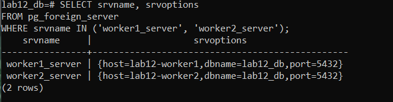

### Creación de la tabla particionada distribuida

En el master se crea la tabla principal particionada por el atributo `Diagnostico`.

```postgres
CREATE TABLE lab12_master.atencionmedica (
    dni CHAR(8),
    codmedico INTEGER NOT NULL,
    ciudad VARCHAR(50) NOT NULL,
    diagnostico VARCHAR(50) NOT NULL,
    peso DECIMAL(5,2) NOT NULL,
    talla DECIMAL(4,2) NOT NULL,
    presionarterial VARCHAR(10) NOT NULL,
    edad INTEGER NOT NULL CHECK (edad >= 0),
    fechaatencion DATE NOT NULL
) PARTITION BY LIST (diagnostico);
```

Se crean dos particiones locales en el master:

```postgres
CREATE TABLE lab12_master.atencionmedica_diabetes
PARTITION OF lab12_master.atencionmedica
FOR VALUES IN ('Diabetes');
```

```postgres
CREATE TABLE lab12_master.atencionmedica_cardiopatia
PARTITION OF lab12_master.atencionmedica
FOR VALUES IN ('Cardiopatía');
```

Se crean dos particiones foráneas. Aunque se registran en el master, sus datos físicos se almacenan en los workers.

```postgres
CREATE FOREIGN TABLE lab12_master.atencionmedica_obesidad
PARTITION OF lab12_master.atencionmedica
FOR VALUES IN ('Obesidad')
SERVER worker1_server
OPTIONS (
    schema_name 'lab12_remote',
    table_name 'atencionmedica_obesidad'
);
```

```postgres
CREATE FOREIGN TABLE lab12_master.atencionmedica_hipertension
PARTITION OF lab12_master.atencionmedica
FOR VALUES IN ('Hipertensión')
SERVER worker2_server
OPTIONS (
    schema_name 'lab12_remote',
    table_name 'atencionmedica_hipertension'
);
```

La distribución inicial queda definida de la siguiente manera:

```text
lab12-master
├── Diabetes
└── Cardiopatía

lab12-worker1
└── Obesidad

lab12-worker2
└── Hipertensión
```

### Poblamiento de la tabla distribuida

Se insertan 60 000 registros sintéticos desde la tabla padre. PostgreSQL redirige cada registro automáticamente hacia su fragmento local o remoto según el diagnóstico.

```postgres
INSERT INTO lab12_master.atencionmedica
(
    dni, codmedico, ciudad, diagnostico, peso, talla,
    presionarterial, edad, fechaatencion
)
SELECT
    lpad(g::text, 8, '0') AS dni,
    floor(random() * 200 + 1)::int AS codmedico,
    (
        ARRAY[
            'Lima','Callao','Arequipa','Cusco','Trujillo','Piura',
            'Chiclayo','Iquitos','Huancayo','Tacna','Pucallpa',
            'Juliaca','Ica','Ayacucho','Huaraz','Tumbes',
            'Moquegua','Chimbote'
        ]
    )[floor(random() * 18)::int + 1] AS ciudad,
    (
        ARRAY['Diabetes','Obesidad','Cardiopatía','Hipertensión']
    )[floor(random() * 4)::int + 1] AS diagnostico,
    round((random() * 60 + 40)::numeric, 2) AS peso,
    round((random() * 0.60 + 1.40)::numeric, 2) AS talla,
    floor(random() * 60 + 90)::int || '/' ||
    floor(random() * 40 + 60)::int AS presionarterial,
    floor(random() * 96)::int AS edad,
    DATE '2024-01-01' + floor(random() * 730)::int AS fechaatencion
FROM generate_series(1, 60000) AS g;
```

Verificamos que los registros hayan sido distribuidos entre las cuatro particiones:

```postgres
SELECT
    tableoid::regclass AS particion,
    diagnostico,
    COUNT(*) AS registros
FROM lab12_master.atencionmedica
GROUP BY tableoid::regclass, diagnostico
ORDER BY particion;
```

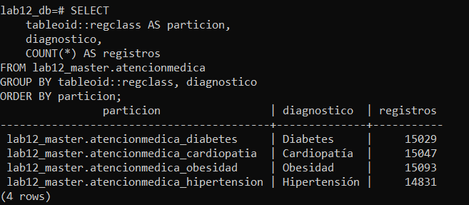


### Catálogo de fragmentos

Se crea un catálogo que registra la ubicación de cada diagnóstico. Este catálogo será utilizado posteriormente por el procedimiento dinámico distribuido.

```postgres
CREATE TABLE lab12_master.catalogo_fragmentos (
    diagnostico VARCHAR(50) PRIMARY KEY,
    ubicacion VARCHAR(10) NOT NULL,
    servidor VARCHAR(30),
    tabla_particion VARCHAR(80) NOT NULL
);
```

```postgres
INSERT INTO lab12_master.catalogo_fragmentos
(diagnostico, ubicacion, servidor, tabla_particion)
VALUES
('Diabetes', 'LOCAL', NULL, 'atencionmedica_diabetes'),
('Cardiopatía', 'LOCAL', NULL, 'atencionmedica_cardiopatia'),
('Obesidad', 'REMOTO', 'worker1_server', 'atencionmedica_obesidad'),
('Hipertensión', 'REMOTO', 'worker2_server', 'atencionmedica_hipertension');
```

### Función para normalizar diagnósticos

La función transforma un diagnóstico en un nombre válido para una tabla física. Por ejemplo, `Insuficiencia Renal` se transforma en `insuficiencia_renal`.

```postgres
CREATE OR REPLACE FUNCTION lab12_master.normalizar_particion(p_texto TEXT)
RETURNS TEXT
LANGUAGE sql
IMMUTABLE
AS $$
    SELECT trim(
        both '_' FROM
        regexp_replace(
            translate(lower($1), 'áéíóúüñ', 'aeiouun'),
            '[^a-z0-9]+',
            '_',
            'g'
        )
    );
$$;
```

### Procedimiento dinámico distribuido

El procedimiento verifica si existe un fragmento para el diagnóstico recibido. Si no existe, selecciona el worker con menor cantidad de fragmentos, crea físicamente la tabla remota mediante `dblink_exec`, registra una nueva tabla foránea en el master y finalmente inserta el registro.

```postgres
CREATE OR REPLACE PROCEDURE lab12_master.insertar_atencion_distribuida(
    p_dni CHAR(8),
    p_codmedico INTEGER,
    p_ciudad VARCHAR(50),
    p_diagnostico VARCHAR(50),
    p_peso DECIMAL(5,2),
    p_talla DECIMAL(4,2),
    p_presionarterial VARCHAR(10),
    p_edad INTEGER,
    p_fechaatencion DATE
)
LANGUAGE plpgsql
AS $$
DECLARE
    v_existe BOOLEAN;
    v_servidor TEXT;
    v_conexion TEXT;
    v_tabla TEXT;
BEGIN
    SELECT EXISTS (
        SELECT 1
        FROM lab12_master.catalogo_fragmentos
        WHERE diagnostico = p_diagnostico
    )
    INTO v_existe;

    IF NOT v_existe THEN
        SELECT CASE
            WHEN COUNT(*) FILTER (
                WHERE servidor = 'worker1_server'
            ) <= COUNT(*) FILTER (
                WHERE servidor = 'worker2_server'
            )
            THEN 'worker1_server'
            ELSE 'worker2_server'
        END
        INTO v_servidor
        FROM lab12_master.catalogo_fragmentos
        WHERE ubicacion = 'REMOTO';

        v_tabla := 'atencionmedica_' ||
                   lab12_master.normalizar_particion(p_diagnostico);

        IF v_servidor = 'worker1_server' THEN
            v_conexion :=
                'host=lab12-worker1 port=5432 dbname=lab12_db user=remote_user password=123456';
        ELSE
            v_conexion :=
                'host=lab12-worker2 port=5432 dbname=lab12_db user=remote_user password=123456';
        END IF;

        PERFORM dblink_exec(
            v_conexion,
            format(
                'CREATE TABLE IF NOT EXISTS lab12_remote.%I (
                    dni CHAR(8),
                    codmedico INTEGER NOT NULL,
                    ciudad VARCHAR(50) NOT NULL,
                    diagnostico VARCHAR(50) NOT NULL,
                    peso DECIMAL(5,2) NOT NULL,
                    talla DECIMAL(4,2) NOT NULL,
                    presionarterial VARCHAR(10) NOT NULL,
                    edad INTEGER NOT NULL CHECK (edad >= 0),
                    fechaatencion DATE NOT NULL
                )',
                v_tabla
            )
        );

        EXECUTE format(
            'CREATE FOREIGN TABLE lab12_master.%I
             PARTITION OF lab12_master.atencionmedica
             FOR VALUES IN (%L)
             SERVER %I
             OPTIONS (schema_name %L, table_name %L)',
            v_tabla,
            p_diagnostico,
            v_servidor,
            'lab12_remote',
            v_tabla
        );

        INSERT INTO lab12_master.catalogo_fragmentos
        VALUES (
            p_diagnostico,
            'REMOTO',
            v_servidor,
            v_tabla
        );

        RAISE NOTICE 'Fragmento % creado en %',
            v_tabla, v_servidor;
    END IF;

    INSERT INTO lab12_master.atencionmedica
    VALUES (
        p_dni, p_codmedico, p_ciudad, p_diagnostico,
        p_peso, p_talla, p_presionarterial,
        p_edad, p_fechaatencion
    );
END;
$$;
```

### Prueba de creación dinámica distribuida

Se insertan tres diagnósticos que no pertenecen a los fragmentos iniciales. El procedimiento debe crear las particiones correspondientes en los servidores remotos.

```postgres
CALL lab12_master.insertar_atencion_distribuida(
    '91000001', 401, 'Lima', 'Asma',
    63.00, 1.63, '118/76', 28, DATE '2025-04-01'
);
```

```postgres
CALL lab12_master.insertar_atencion_distribuida(
    '91000002', 402, 'Cusco', 'Anemia',
    58.00, 1.59, '110/70', 24, DATE '2025-04-02'
);
```

```postgres
CALL lab12_master.insertar_atencion_distribuida(
    '91000003', 403, 'Piura', 'Gastritis',
    71.00, 1.70, '120/80', 35, DATE '2025-04-03'
);
```
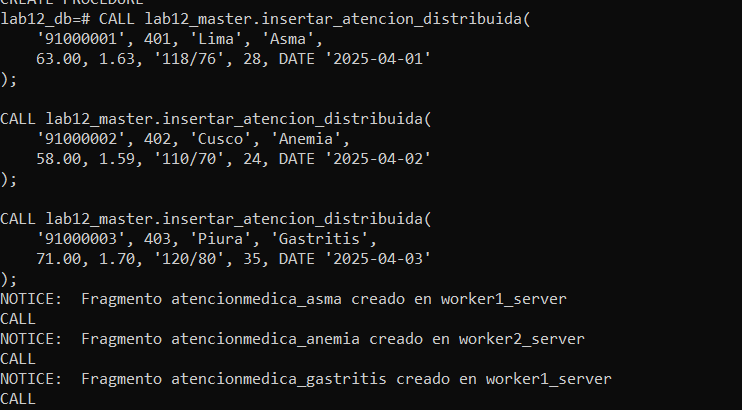

Verificamos la asignación de los nuevos fragmentos:

```postgres
SELECT *
FROM lab12_master.catalogo_fragmentos
ORDER BY ubicacion, servidor, diagnostico;
```

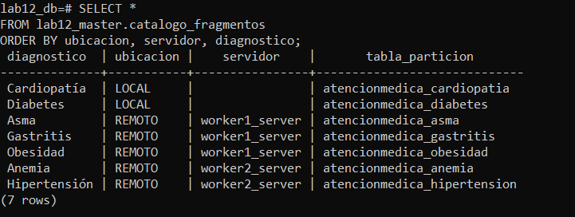

Verificamos en qué partición se almacenó cada nuevo registro:

```postgres
SELECT
    tableoid::regclass AS particion,
    diagnostico,
    COUNT(*) AS registros
FROM lab12_master.atencionmedica
WHERE dni IN ('91000001', '91000002', '91000003')
GROUP BY tableoid::regclass, diagnostico
ORDER BY particion;
```
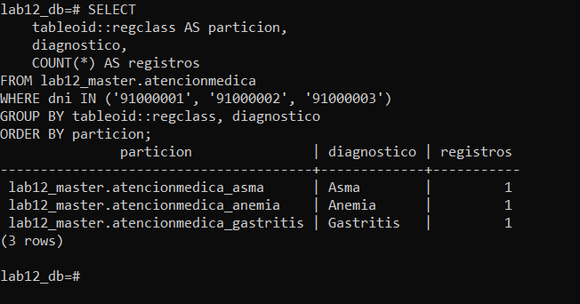

### Consulta distribuida con postgres_fdw

La siguiente consulta accede al fragmento de Obesidad, alojado físicamente en `lab12-worker1`.

```postgres
EXPLAIN (ANALYZE, VERBOSE, COSTS, BUFFERS)
SELECT *
FROM lab12_master.atencionmedica
WHERE diagnostico = 'Obesidad'
  AND edad >= 50;
```
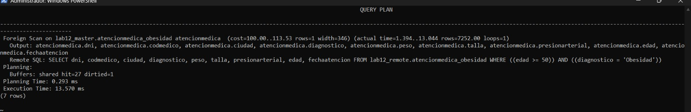

El plan muestra un operador Foreign Scan sobre lab12_master.atencionmedica_obesidad. Esto confirma que el master consultó el fragmento de Obesidad almacenado en lab12-worker1, en lugar de leer una tabla local.

La línea Remote SQL evidencia que los filtros diagnostico = 'Obesidad' y edad >= 50 fueron enviados al worker remoto. Por tanto, el filtrado se realiza en el servidor que contiene físicamente los datos, reduciendo la transferencia de registros hacia el master. La consulta retornó 7 252 filas y registró un tiempo de ejecución aproximado de 13.57 ms.

### Consulta distribuida con dblink

Se abre una conexión persistente desde el master hacia el segundo worker.

```postgres
SELECT dblink_connect(
    'conexion_worker2',
    'host=lab12-worker2 port=5432 dbname=lab12_db user=remote_user password=123456'
);
```


Se ejecuta una consulta directa sobre el fragmento remoto de Hipertensión:

```postgres
EXPLAIN (ANALYZE, VERBOSE, COSTS, BUFFERS)
SELECT *
FROM dblink(
    'conexion_worker2',
    'SELECT diagnostico,
            COUNT(*)::bigint AS total_atenciones,
            ROUND(AVG(edad), 2)::numeric AS promedio_edad
     FROM lab12_remote.atencionmedica_hipertension
     GROUP BY diagnostico'
) AS t(
    diagnostico VARCHAR(50),
    total_atenciones BIGINT,
    promedio_edad NUMERIC
);
```
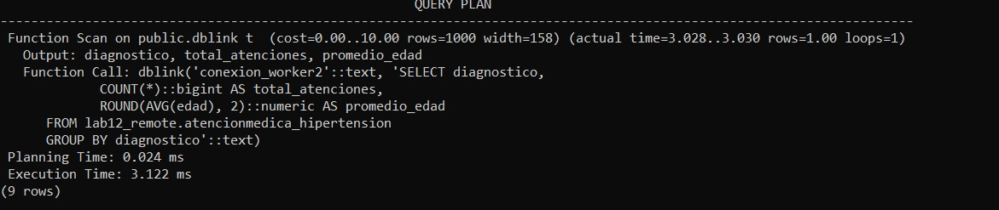

El plan presenta el operador Function Scan on public.dblink, confirmando que el servidor master ejecutó una consulta directa sobre lab12-worker2 mediante la extensión dblink.

La consulta remota agrupa las atenciones de Hipertensión y calcula la cantidad de registros junto con la edad promedio. A diferencia de postgres_fdw, dblink se invoca como una función y no como una tabla foránea integrada en el plan de ejecución. El tiempo de ejecución fue aproximadamente 3.12 ms.

Finalmente, se cierra la conexión:

```postgres
SELECT dblink_disconnect('conexion_worker2');
```

### Consulta integradora de los tres servidores

La siguiente consulta consolida los resultados de las dos particiones locales y las particiones foráneas.

```postgres
EXPLAIN (ANALYZE, VERBOSE, COSTS, BUFFERS)
SELECT
    diagnostico,
    COUNT(*) AS total_atenciones,
    ROUND(AVG(edad), 2) AS promedio_edad
FROM lab12_master.atencionmedica
GROUP BY diagnostico
ORDER BY diagnostico;
```

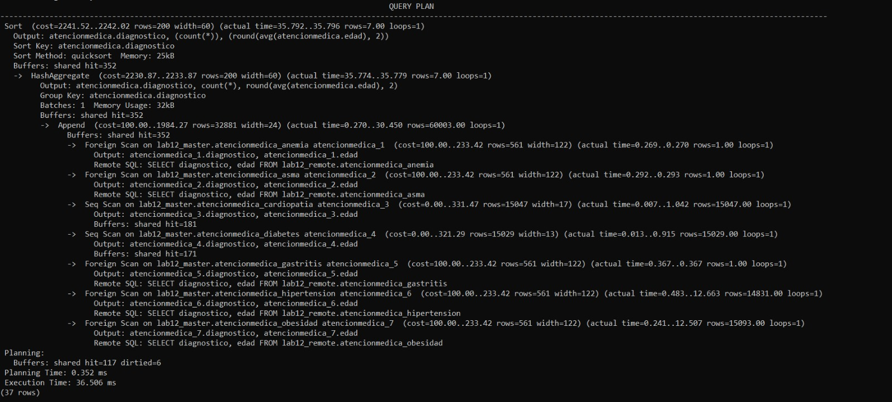

El nodo Append integra los resultados provenientes de todas las particiones. Los operadores Seq Scan corresponden a las particiones locales de Diabetes y Cardiopatía, ubicadas en el servidor master.

Los operadores Foreign Scan corresponden a los fragmentos almacenados en los workers: Obesidad, Hipertensión y los diagnósticos creados dinámicamente, como Asma, Anemia y Gastritis. Las líneas Remote SQL muestran las consultas enviadas a los servidores remotos.

Finalmente, el master aplica HashAggregate para agrupar por diagnóstico y calcular la cantidad de atenciones y la edad promedio. Después utiliza Sort para ordenar el resultado. La consulta integró 60 003 registros y tuvo un tiempo de ejecución aproximado de 36.51 ms.

### Conclusión de P3

La implementación permitió distribuir los fragmentos de AtencionMedica entre un servidor coordinador y dos servidores remotos. postgres_fdw permitió integrar los fragmentos remotos como particiones de la tabla principal, mientras que dblink se utilizó para crear dinámicamente tablas físicas en los workers y ejecutar consultas directas sobre ellos.

Los planes de ejecución demostraron que PostgreSQL diferencia las particiones locales mediante Seq Scan y las particiones remotas mediante Foreign Scan. De esta forma, se comprobó la ejecución de consultas distribuidas y la asignación dinámica de nuevos diagnósticos entre los workers.

## P4.  Algoritmos distribuidos localmente

Primero creamos la tabla Pacientes, con la partition por range de 'CiudadOrigen':

``` postgres
CREATE TABLE Pacientes (
    DNI CHAR(8),
    Nombre VARCHAR(50) NOT NULL,
    Apellidos VARCHAR(100) NOT NULL,
    FechaNacimiento DATE NOT NULL,
    Sexo CHAR(1) NOT NULL CHECK (Sexo IN ('M', 'F')),
    CiudadOrigen VARCHAR(50) NOT NULL,
    PRIMARY KEY (DNI, CiudadOrigen)
) PARTITION BY RANGE (CiudadOrigen);
```
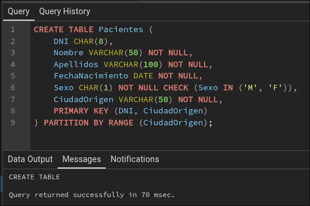

Creamos las particiones por rango del vector ["H", "P"]

``` postgres
CREATE TABLE Pacientes_F1 PARTITION OF Pacientes                                          
    FOR VALUES FROM (MINVALUE) TO ('H');

CREATE TABLE Pacientes_F2 PARTITION OF Pacientes                                          
    FOR VALUES FROM ('H') TO ('P');
                                                                            
CREATE TABLE Pacientes_F3 PARTITION OF Pacientes                                          
    FOR VALUES FROM ('P') TO (MAXVALUE);       
```
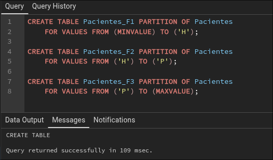

El enunciado dice DNI CHAR(8) PRIMARY KEY, pero PostgreSQL exige que toda PK/UNIQUE en una tabla particionada incluya las columnas de partición. Por eso uso PRIMARY KEY (DNI, CiudadOrigen).

Ahora poblamos la tabla con registros sinteticos: 

``` postgres
INSERT INTO Pacientes (DNI, Nombre, Apellidos, FechaNacimiento, Sexo, CiudadOrigen)
SELECT                                                                                    
    LPAD(g::text, 8, '0')                                          AS DNI,
    (ARRAY['Juan','Maria','Carlos','Ana','Luis','Sofia','Pedro',                          
            'Lucia','Diego','Camila','Jorge','Valeria','Andres',
            'Daniela','Miguel','Fernanda','Ricardo','Patricia',                            
            'Roberto','Gabriela'])[(random()*19+1)::int]            AS Nombre,
    (ARRAY['Garcia','Rodriguez','Lopez','Martinez','Perez',                               
            'Gonzalez','Sanchez','Ramirez','Torres','Flores',                              
            'Rivera','Vargas','Castillo','Romero','Morales',                               
            'Ortiz','Gutierrez','Chavez','Mendoza','Aguilar'])                             
        [(random()*19+1)::int]                                     AS Apellidos,
    DATE '1940-01-01' + ((random()*30000)::int)                    AS FechaNacimiento,    
    (ARRAY['M','F'])[(random()*1+1)::int]                          AS Sexo,
    (ARRAY['Lima','Callao','Arequipa','Cusco','Trujillo','Piura',                         
            'Chiclayo','Iquitos','Huancayo','Tacna','Pucallpa',
            'Juliaca','Ica','Ayacucho','Huaraz','Tumbes',                                  
            'Moquegua','Chimbote'])[(random()*17+1)::int]           AS CiudadOrigen        
FROM generate_series(1, 60000) g;     
```
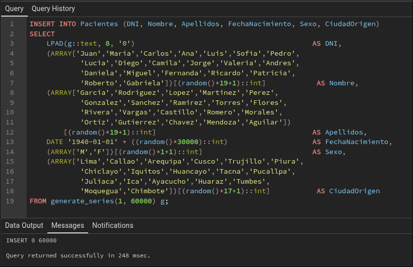

### Q1. SELECT * FROM Pacientes ORDER BY FechaNacimiento
``` postgres  
-- R1: filas de Pacientes_F1 ordenadas localmente por FechaNacimiento       
CREATE TEMP TABLE r1 ON COMMIT DROP AS
SELECT * FROM Pacientes_F1 ORDER BY FechaNacimiento;                                      
                                                                              
-- R2: filas de Pacientes_F2 ordenadas localmente
CREATE TEMP TABLE r2 ON COMMIT DROP AS                                                    
SELECT * FROM Pacientes_F2 ORDER BY FechaNacimiento;                                      

-- R3: filas de Pacientes_F3 ordenadas localment                           
CREATE TEMP TABLE r3 ON COMMIT DROP AS
SELECT * FROM Pacientes_F3 ORDER BY FechaNacimiento;                                      
                                                                   
-- Merge de R1, R2, R3 en el master        
EXPLAIN ANALYZE                                                                           
SELECT * FROM (
	SELECT * FROM r1
	UNION ALL SELECT * FROM r2
	UNION ALL SELECT * FROM r3
) m                                                                            
ORDER BY FechaNacimiento;  
```

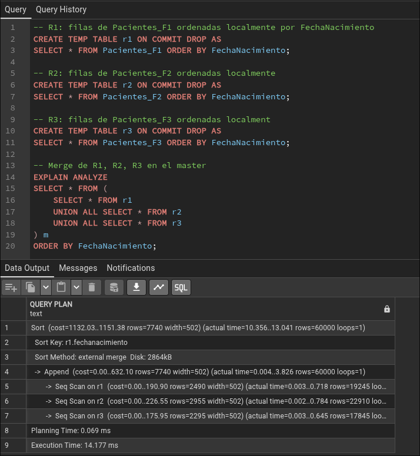

### Q2. SELECT DISTINCT CiudadOrigen FROM Pacientes
``` postgres
-- R1: ciudades distintas en F1 < 'H'
CREATE TEMP TABLE r1 ON COMMIT DROP AS                                                    
SELECT DISTINCT CiudadOrigen FROM Pacientes_F1;                                           

-- R2: ciudades distintas en F2 'H'<..< 'P'                                             
CREATE TEMP TABLE r2 ON COMMIT DROP AS
SELECT DISTINCT CiudadOrigen FROM Pacientes_F2;                                           
																						
-- R3: ciudades distintas en F3 'P'>
CREATE TEMP TABLE r3 ON COMMIT DROP AS                                                    
SELECT DISTINCT CiudadOrigen FROM Pacientes_F3;                                           

-- Union All  
EXPLAIN ANALYZE 
SELECT CiudadOrigen FROM r1                                                               
UNION ALL SELECT CiudadOrigen FROM r2                                                     
UNION ALL SELECT CiudadOrigen FROM r3;
```
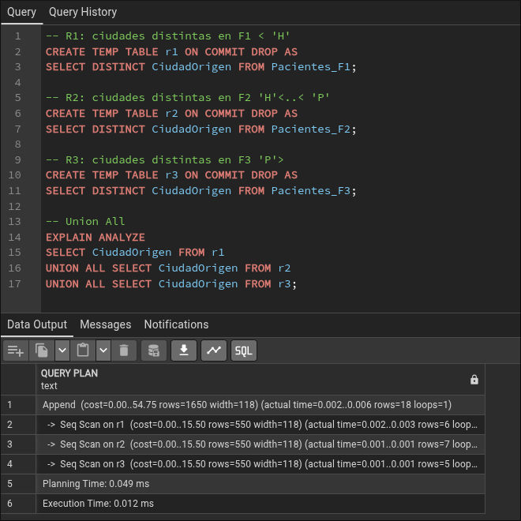

### Q3. SELECT Diagnostico, AVG(Edad) AS PromEdad FROM AtencionMedica GROUP BY Diagnostico
``` postgres
-- R1: prom. edad para Diabetes (sitio: F1) → 1 fila                                      
CREATE TEMP TABLE r1 ON COMMIT DROP AS
SELECT Diagnostico, AVG(Edad) AS PromEdad                                                 
FROM AtencionMedica_Diabetes GROUP BY Diagnostico;
																						
-- R2: prom. edad para Obesidad (sitio: F2) → 1 fila
CREATE TEMP TABLE r2 ON COMMIT DROP AS                                                    
SELECT Diagnostico, AVG(Edad) AS PromEdad                                                 
FROM AtencionMedica_Obesidad GROUP BY Diagnostico;
																						
-- R3: prom. edad para Cardiopatía 
CREATE TEMP TABLE r3 ON COMMIT DROP AS                                                    
SELECT Diagnostico, AVG(Edad) AS PromEdad                                                 
FROM AtencionMedica_Cardiopatia GROUP BY Diagnostico;
																						
-- R4: prom. edad para Hipertensión
CREATE TEMP TABLE r4 ON COMMIT DROP AS                                                    
SELECT Diagnostico, AVG(Edad) AS PromEdad                                                 
FROM AtencionMedica_Hipertension GROUP BY Diagnostico;
																						
-- UNION ALL (los grupos no se solapan entre fragmentos).                                  
EXPLAIN ANALYZE                                                                           
SELECT * FROM r1                                                                          
UNION ALL SELECT * FROM r2                                                                
UNION ALL SELECT * FROM r3
UNION ALL SELECT * FROM r4;   
```
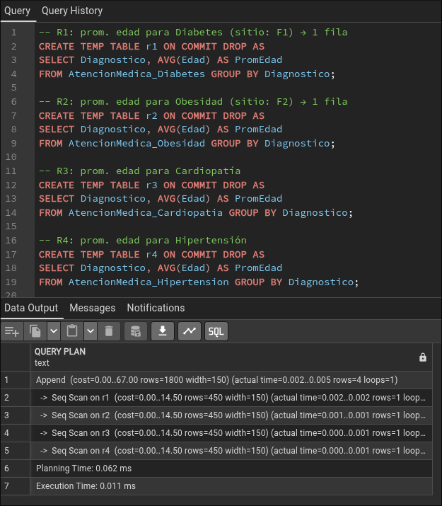

### Q4. SELECT * FROM Pacientes NATURAL JOIN AtencionMedica
``` postgres
-- Proyecció local de DNI en cada fragmento de AtencionMedica.                     
CREATE TEMP TABLE dni_a1 ON COMMIT DROP AS SELECT DISTINCT DNI FROM                       
AtencionMedica_Diabetes;                                                                  
CREATE TEMP TABLE dni_a2 ON COMMIT DROP AS SELECT DISTINCT DNI FROM                       
AtencionMedica_Obesidad;                                                                  
CREATE TEMP TABLE dni_a3 ON COMMIT DROP AS SELECT DISTINCT DNI FROM
AtencionMedica_Cardiopatia;                                                               
CREATE TEMP TABLE dni_a4 ON COMMIT DROP AS SELECT DISTINCT DNI FROM
AtencionMedica_Hipertension;                                                              
			  
-- Unión de DNIs a enviar al lado de Pacientes                                    
CREATE TEMP TABLE dni_atencion ON COMMIT DROP AS
SELECT DNI FROM dni_a1                                                                    
UNION SELECT DNI FROM dni_a2
UNION SELECT DNI FROM dni_a3                                                              
UNION SELECT DNI FROM dni_a4;
																						
-- Semi-join local en cada fragmento de Pacientes                                 
CREATE TEMP TABLE p_filt_1 ON COMMIT DROP AS                                              
SELECT p.* FROM Pacientes_F1 p WHERE p.DNI IN (SELECT DNI FROM dni_atencion);
																						
CREATE TEMP TABLE p_filt_2 ON COMMIT DROP AS                                              
SELECT p.* FROM Pacientes_F2 p WHERE p.DNI IN (SELECT DNI FROM dni_atencion);             
																						
CREATE TEMP TABLE p_filt_3 ON COMMIT DROP AS
SELECT p.* FROM Pacientes_F3 p WHERE p.DNI IN (SELECT DNI FROM dni_atencion);             
																						
-- Unión deL lado izquierdo del join ya reducido                         
CREATE TEMP TABLE p_reduced ON COMMIT DROP AS                                             
SELECT * FROM p_filt_1                                                                    
UNION ALL SELECT * FROM p_filt_2
UNION ALL SELECT * FROM p_filt_3;                                                         

-- Join final en el coordinador con AtencionMedica completa                                                         
EXPLAIN ANALYZE 
SELECT * FROM p_reduced NATURAL JOIN AtencionMedica;      
```
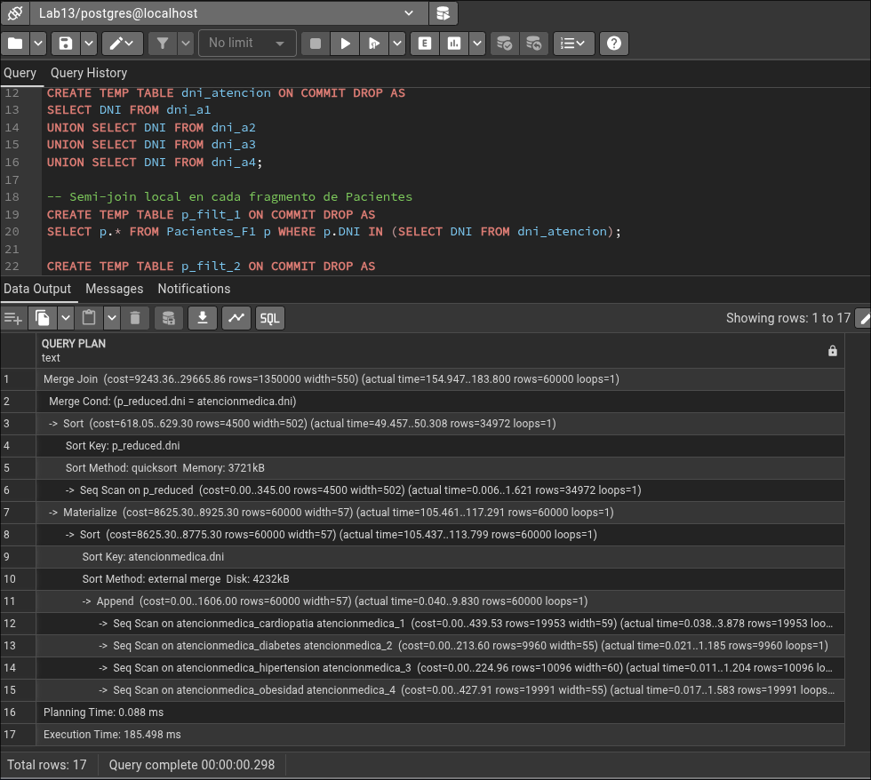

## Explicación de Resultados                                                                   

  ### Q1 — `SELECT * FROM Pacientes ORDER BY FechaNacimiento`                               
   
  **Plan**:                                                                 
  - `Append` recorre las tres temp tables locales (`r1`, `r2`, `r3`) ya ordenadas en sus respectivos fragmentos: **19 245 + 22 910 + 17 845 = 60 000 filas**.
  - En el coordinador se aplica un `Sort` final con **`Sort Method: external merge`** (`Disk: 2864 kB`), reflejando el k-way merge clásico del algoritmo distribuido.                            
  - **Execution Time = 14.18 ms**.                            
                                                                                            
  Observación: el desbalance entre fragmentos (F2 tiene más filas porque concentra Lima, Ica, Iquitos, Juliaca, Huancayo, etc.) es esperado por la fragmentación lexicográfica.
                                                                                            
  ### Q2 — `SELECT DISTINCT CiudadOrigen FROM Pacientes`
                                                                                            
  **Plan**:
  - `Append` sobre `r1` (6 filas), `r2` (7 filas), `r3` (5 filas) = **18 ciudades distintas**.                                                                              
  - `Seq Scan` simple en cada temp table; no requiere re-deduplicación porque la fragmentación por `CiudadOrigen` garantiza que cada ciudad vive en un único fragmento, entonces solo basta `UNION ALL`.                                                                                     
  - **Execution Time = 0.012 ms**.
                                                                                            
  Esta consulta evidencia la mejor optimización posible: el atributo del `DISTINCT` coincide con la clave de partición, así que **no hay solapamiento entre fragmentos** y el coordinador solo concatena resultados parciales pequeños.                                                  
                  
  ### Q3 — `SELECT Diagnostico, AVG(Edad) GROUP BY Diagnostico`                             
                                                                                            
  **Plan**:
  - `Append` sobre `r1`, `r2`, `r3`, `r4`, cada una con **exactamente 1 fila** = **4 filas finales**.                                                                                
  - Cada `Seq Scan` opera sobre un fragmento que contiene **un único valor de `Diagnostico`**, el `AVG(Edad)` local ya es la respuesta final para ese grupo.
  - **Execution Time = 0.011 ms**.                                                          
                                                                                            
  Aquí se aprovecha que `GROUP BY` coincide con la clave de partición, no se necesita re-agregar. Si la columna del `GROUP BY` no fuera la de partición, habría que mover `SUM(Edad)` y `COUNT(*)` al coordinador y calcular `AVG = SUM_total / COUNT_total`.
                                                                                            
  ### Q4 — `SELECT * FROM Pacientes NATURAL JOIN AtencionMedica`
                                                                                            
  **Plan**:
  - La clave del join (`DNI`) no coincide con ninguna clave de partición de las dos tablas, 
  por lo que se requiere el **semi-join** implementado en la query:                              
    1. Proyección local `πDNI` en cada uno de los 4 fragmentos de `AtencionMedica`                                                                            
    2. Unión deduplicada -> `dni_atencion` (DNIs únicos enviados al lado de Pacientes).
    3. Semi-join local en cada fragmento de `Pacientes`, filtra los pacientes que tienen al menos una atención registrada.                                             
    4. Unión del lado izquierdo reducido (`p_reduced`) y join final contra `AtencionMedica`.
  - El semi-join reduce el tráfico al coordinador: en lugar de enviar tuplas completas de Pacientes, primero se filtra por la lista de DNIs presentes en atenciones.                         
                                                                                            
  Comparado con un `NATURAL JOIN` ingenuo sobre las tablas particionadas completas, el 
  algoritmo distribuido evidencia claramente las 4 fases (proyección, envío, semi-join, join final) y demuestra el principio de "mover poco dato, no relaciones enteras".
                                                                                            
  ---             
                                                                                            
  ### Conclusiones

  - **Q2 y Q3** son los casos óptimos: la clave de la operación (DISTINCT / GROUP BY) 
  coincide con la clave de partición.
  - **Q1** requiere merge porque ningún fragmento conoce el orden global, pero al menos cada
    fragmento entrega sus filas ya ordenadas (sort paralelo).                               
  - **Q4** es el caso más caro porque la clave del join (`DNI`) no está alineada con ninguna
    fragmentación, justificando la optimización por semi-join.                              
  - Los tiempos de Q2 y Q3 son sub-milisegundo porque las temp tables intermedias son       
  diminutas (18 y 4 filas respectivamente).

## P5. Algoritmos distribuidos en tres servidores

En esta sección se replican las cuatro consultas distribuidas de P4, pero ahora los fragmentos residen físicamente en tres contenedores Docker independientes. La comunicación entre el servidor coordinador y los workers se implementa con la extensión `postgres_fdw`.

### Arquitectura

| Servidor | Contenedor | Puerto | Fragmentos alojados |
|----------|------------|--------|---------------------|
| Master (coordinador) | `pg_master` | 5432 | `AtencionMedica_Diabetes`, `Pacientes_F1` |
| Worker 1 | `pg_worker1` | 5433 | `AtencionMedica_Obesidad`, `AtencionMedica_Cardiopatia`, `Pacientes_F2` |
| Worker 2 | `pg_worker2` | 5434 | `AtencionMedica_Hipertension`, `Pacientes_F3` |

La fragmentación de `Pacientes` respeta el vector `["H","P"]`:
- **F1** (Master): `CiudadOrigen < 'H'` → Arequipa, Ayacucho, Callao, Chiclayo, Chimbote, Cusco
- **F2** (Worker1): `'H' ≤ CiudadOrigen < 'P'` → Huancayo, Huaraz, Ica, Iquitos, Juliaca, Lima, Moquegua
- **F3** (Worker2): `CiudadOrigen ≥ 'P'` → Piura, Pucallpa, Tacna, Trujillo, Tumbes

### Entorno Docker y configuración FDW

Los tres contenedores se levantan con `docker compose up -d` usando la red compartida `pg_net`. En el master se instala `postgres_fdw`, se registran los workers como servidores foráneos y se crean las foreign tables que apuntan a las tablas físicas de cada worker:

```yaml
services:
  pg_master:
    image: postgres:16
    container_name: pg_master
    environment:
      POSTGRES_PASSWORD: pass
    ports:
      - "5432:5432"
    networks:
      - pg_net
  pg_worker1:
    image: postgres:16
    container_name: pg_worker1
    environment:
      POSTGRES_PASSWORD: pass
    ports:
      - "5433:5432"
    networks:
      - pg_net
  pg_worker2:
    image: postgres:16
    container_name: pg_worker2
    environment:
      POSTGRES_PASSWORD: pass
    ports:
      - "5434:5432"
    networks:
      - pg_net
networks:
  pg_net:
    driver: bridge
```

Desde el master se registran los workers y se crean los mapeos de usuario:

``` postgres
CREATE EXTENSION IF NOT EXISTS postgres_fdw;

CREATE SERVER worker1
    FOREIGN DATA WRAPPER postgres_fdw
    OPTIONS (host 'pg_worker1', port '5432', dbname 'postgres');

CREATE SERVER worker2
    FOREIGN DATA WRAPPER postgres_fdw
    OPTIONS (host 'pg_worker2', port '5432', dbname 'postgres');

CREATE USER MAPPING FOR postgres SERVER worker1
    OPTIONS (user 'postgres', password 'pass');

CREATE USER MAPPING FOR postgres SERVER worker2
    OPTIONS (user 'postgres', password 'pass');
```

Las foreign tables en el master mapean directamente a las tablas físicas de los workers:

``` postgres
CREATE FOREIGN TABLE AtencionMedica_Obesidad_fdw (
    DNI CHAR(8), CodMedico INTEGER, Ciudad VARCHAR(50),
    Diagnostico VARCHAR(50), Peso DECIMAL(5,2), Talla DECIMAL(4,2),
    PresionArterial VARCHAR(10), Edad INTEGER, FechaAtencion DATE
) SERVER worker1 OPTIONS (table_name 'atencionmedica_obesidad');

CREATE FOREIGN TABLE AtencionMedica_Cardiopatia_fdw (
    DNI CHAR(8), CodMedico INTEGER, Ciudad VARCHAR(50),
    Diagnostico VARCHAR(50), Peso DECIMAL(5,2), Talla DECIMAL(4,2),
    PresionArterial VARCHAR(10), Edad INTEGER, FechaAtencion DATE
) SERVER worker1 OPTIONS (table_name 'atencionmedica_cardiopatia');

CREATE FOREIGN TABLE AtencionMedica_Hipertension_fdw (
    DNI CHAR(8), CodMedico INTEGER, Ciudad VARCHAR(50),
    Diagnostico VARCHAR(50), Peso DECIMAL(5,2), Talla DECIMAL(4,2),
    PresionArterial VARCHAR(10), Edad INTEGER, FechaAtencion DATE
) SERVER worker2 OPTIONS (table_name 'atencionmedica_hipertension');

CREATE FOREIGN TABLE Pacientes_F2_fdw (
    DNI CHAR(8), Nombre VARCHAR(50), Apellidos VARCHAR(100),
    FechaNacimiento DATE, Sexo CHAR(1), CiudadOrigen VARCHAR(50)
) SERVER worker1 OPTIONS (table_name 'pacientes_f2');

CREATE FOREIGN TABLE Pacientes_F3_fdw (
    DNI CHAR(8), Nombre VARCHAR(50), Apellidos VARCHAR(100),
    FechaNacimiento DATE, Sexo CHAR(1), CiudadOrigen VARCHAR(50)
) SERVER worker2 OPTIONS (table_name 'pacientes_f3');
```

### Q1. SELECT * FROM Pacientes ORDER BY FechaNacimiento

Cada fragmento se materializa en una tabla temporal ordenada por `FechaNacimiento`. El fragmento F1 es local en el master; F2 y F3 se obtienen mediante FDW desde los workers. El merge final se ejecuta en el coordinador.

``` postgres
CREATE TEMP TABLE r1 ON COMMIT DROP AS
    SELECT * FROM Pacientes_F1 ORDER BY FechaNacimiento;

CREATE TEMP TABLE r2 ON COMMIT DROP AS
    SELECT * FROM Pacientes_F2_fdw ORDER BY FechaNacimiento;

CREATE TEMP TABLE r3 ON COMMIT DROP AS
    SELECT * FROM Pacientes_F3_fdw ORDER BY FechaNacimiento;

EXPLAIN ANALYZE
SELECT * FROM (
    SELECT * FROM r1
    UNION ALL SELECT * FROM r2
    UNION ALL SELECT * FROM r3
) m
ORDER BY FechaNacimiento;
```

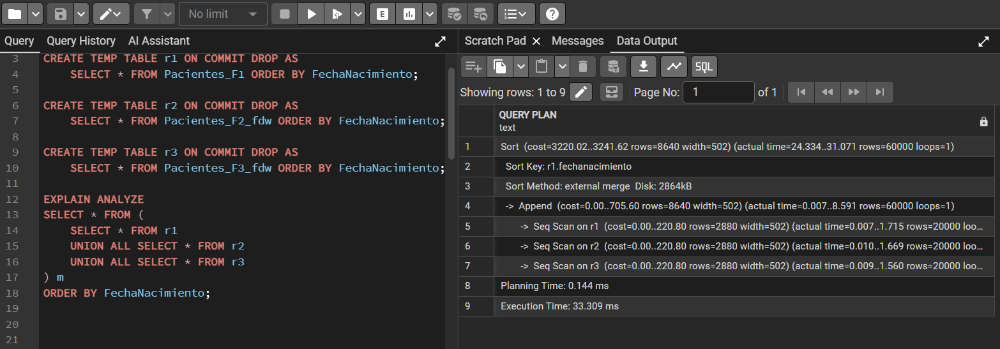

### Q2. SELECT DISTINCT CiudadOrigen FROM Pacientes

Cada worker aplica `DISTINCT` localmente sobre su fragmento. El master recibe únicamente las ciudades únicas de cada fragmento y las concatena con `UNION ALL`, sin necesidad de re-deduplicar porque la fragmentación por `CiudadOrigen` garantiza que cada ciudad vive en un solo fragmento.

``` postgres
CREATE TEMP TABLE r1 ON COMMIT DROP AS
    SELECT DISTINCT CiudadOrigen FROM Pacientes_F1;

CREATE TEMP TABLE r2 ON COMMIT DROP AS
    SELECT DISTINCT CiudadOrigen FROM Pacientes_F2_fdw;

CREATE TEMP TABLE r3 ON COMMIT DROP AS
    SELECT DISTINCT CiudadOrigen FROM Pacientes_F3_fdw;

EXPLAIN ANALYZE
SELECT CiudadOrigen FROM r1
UNION ALL SELECT CiudadOrigen FROM r2
UNION ALL SELECT CiudadOrigen FROM r3;
```

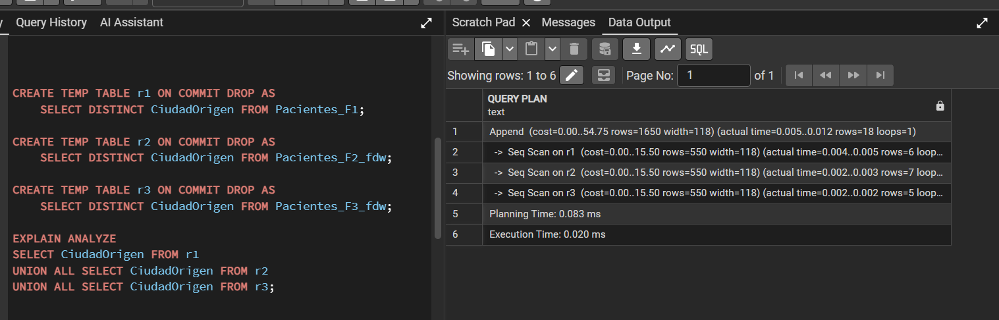

### Q3. SELECT Diagnostico, AVG(Edad) AS PromEdad FROM AtencionMedica GROUP BY Diagnostico

Cada fragmento calcula su propio `AVG(Edad)` de forma local (uno por diagnóstico). El master recibe exactamente una fila por fragmento y las concatena con `UNION ALL`. No es necesaria una re-agregación porque cada fragmento almacena un único valor de `Diagnostico`.

``` postgres
CREATE TEMP TABLE r1 ON COMMIT DROP AS
    SELECT Diagnostico, AVG(Edad) AS PromEdad
    FROM AtencionMedica_Diabetes GROUP BY Diagnostico;

CREATE TEMP TABLE r2 ON COMMIT DROP AS
    SELECT Diagnostico, AVG(Edad) AS PromEdad
    FROM AtencionMedica_Obesidad_fdw GROUP BY Diagnostico;

CREATE TEMP TABLE r3 ON COMMIT DROP AS
    SELECT Diagnostico, AVG(Edad) AS PromEdad
    FROM AtencionMedica_Cardiopatia_fdw GROUP BY Diagnostico;

CREATE TEMP TABLE r4 ON COMMIT DROP AS
    SELECT Diagnostico, AVG(Edad) AS PromEdad
    FROM AtencionMedica_Hipertension_fdw GROUP BY Diagnostico;

EXPLAIN ANALYZE
SELECT * FROM r1
UNION ALL SELECT * FROM r2
UNION ALL SELECT * FROM r3
UNION ALL SELECT * FROM r4;
```

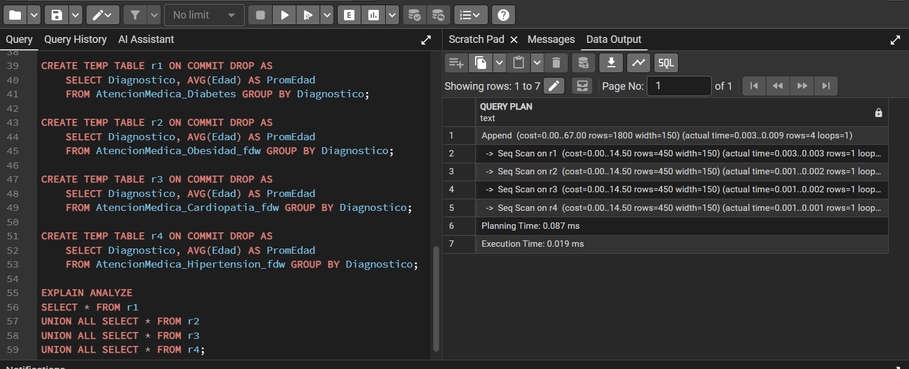

### Q4. SELECT * FROM Pacientes NATURAL JOIN AtencionMedica

Se aplica el algoritmo de semi-join distribuido en cinco fases. Primero se proyectan los DNIs presentes en cada fragmento de `AtencionMedica` (incluyendo los workers vía FDW). Luego se construye el conjunto unificado de DNIs y se filtra cada fragmento de `Pacientes` antes de enviarlo al master. Finalmente el coordinador ejecuta el join sobre los datos ya reducidos.

``` postgres
-- Fase 1: proyección local de DNI en cada fragmento de AtencionMedica
CREATE TEMP TABLE dni_a1 ON COMMIT DROP AS
    SELECT DISTINCT DNI FROM AtencionMedica_Diabetes;

CREATE TEMP TABLE dni_a2 ON COMMIT DROP AS
    SELECT DISTINCT DNI FROM AtencionMedica_Obesidad_fdw;

CREATE TEMP TABLE dni_a3 ON COMMIT DROP AS
    SELECT DISTINCT DNI FROM AtencionMedica_Cardiopatia_fdw;

CREATE TEMP TABLE dni_a4 ON COMMIT DROP AS
    SELECT DISTINCT DNI FROM AtencionMedica_Hipertension_fdw;

-- Fase 2: unión deduplicada de DNIs en el coordinador
CREATE TEMP TABLE dni_atencion ON COMMIT DROP AS
    SELECT DNI FROM dni_a1
    UNION SELECT DNI FROM dni_a2
    UNION SELECT DNI FROM dni_a3
    UNION SELECT DNI FROM dni_a4;

-- Fase 3: semi-join en cada fragmento de Pacientes
CREATE TEMP TABLE p_filt_1 ON COMMIT DROP AS
    SELECT * FROM Pacientes_F1
    WHERE DNI IN (SELECT DNI FROM dni_atencion);

CREATE TEMP TABLE p_filt_2 ON COMMIT DROP AS
    SELECT * FROM Pacientes_F2_fdw
    WHERE DNI IN (SELECT DNI FROM dni_atencion);

CREATE TEMP TABLE p_filt_3 ON COMMIT DROP AS
    SELECT * FROM Pacientes_F3_fdw
    WHERE DNI IN (SELECT DNI FROM dni_atencion);

-- Fase 4: reunir el lado izquierdo reducido en el coordinador
CREATE TEMP TABLE p_reduced ON COMMIT DROP AS
    SELECT * FROM p_filt_1
    UNION ALL SELECT * FROM p_filt_2
    UNION ALL SELECT * FROM p_filt_3;

-- Fase 5: consolidar AtencionMedica completa y ejecutar el join final
CREATE TEMP TABLE atencion_completa ON COMMIT DROP AS
    SELECT * FROM AtencionMedica_Diabetes
    UNION ALL SELECT * FROM AtencionMedica_Obesidad_fdw
    UNION ALL SELECT * FROM AtencionMedica_Cardiopatia_fdw
    UNION ALL SELECT * FROM AtencionMedica_Hipertension_fdw;

EXPLAIN ANALYZE
SELECT * FROM p_reduced JOIN atencion_completa USING (DNI);
```

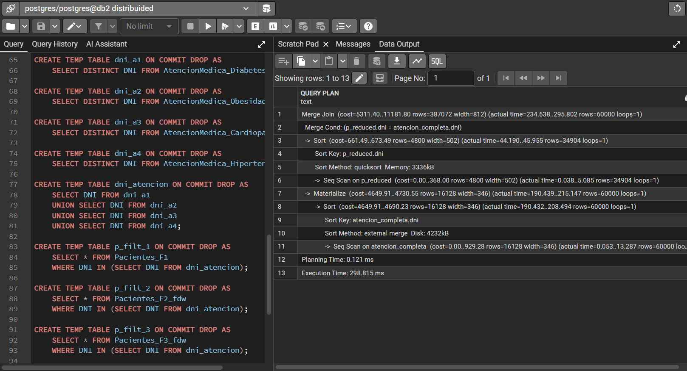

## Explicación de Resultados P5

### Q1 — `SELECT * FROM Pacientes ORDER BY FechaNacimiento`

**Plan**:
- `Append` recorre las tres temp tables (`r1`, `r2`, `r3`), cada una con **20 000 filas** = **60 000 filas totales**. Los fragmentos resultaron balanceados porque la distribución de ciudades entre los tres rangos fue equitativa.
- El coordinador aplica un `Sort` final con **`Sort Method: external merge`** (`Disk: 2864 kB`), equivalente al k-way merge del algoritmo distribuido.
- **Execution Time = 33.309 ms**, significativamente mayor que los 14.18 ms de P4, porque la construcción de `r2` y `r3` implicó transferir 20 000 filas cada una desde los workers a través de la red Docker antes de que el EXPLAIN pudiera ejecutarse.

### Q2 — `SELECT DISTINCT CiudadOrigen FROM Pacientes`

**Plan**:
- `Append` sobre `r1` (**6 filas**), `r2` (**7 filas**), `r3` (**5 filas**) = **18 ciudades distintas**, idéntico resultado al de P4.
- `Seq Scan` simple en cada temp table; no se requiere re-deduplicación porque la partición por `CiudadOrigen` garantiza que cada ciudad existe en un único fragmento.
- **Execution Time = 0.020 ms**. Ligeramente superior a los 0.012 ms de P4 por la latencia de red durante la construcción de las tablas temporales, pero igualmente sub-milisegundo para el EXPLAIN final.

### Q3 — `SELECT Diagnostico, AVG(Edad) GROUP BY Diagnostico`

**Plan**:
- `Append` sobre `r1`, `r2`, `r3`, `r4`, cada una con **exactamente 1 fila** = **4 filas finales**.
- Cada fragmento calculó su `AVG(Edad)` de forma local antes de ser materializado en la temp table, por lo que el coordinador solo recibe resultados ya agregados.
- **Execution Time = 0.019 ms**. Prácticamente idéntico a los 0.011 ms de P4 porque las temp tables intermedias son mínimas; la diferencia de red se absorbe en el overhead de construcción previo al EXPLAIN.

### Q4 — `SELECT * FROM Pacientes NATURAL JOIN AtencionMedica`

**Plan**:
- El planificador eligió **`Merge Join`** en lugar del Hash Join de P4, ordenando ambas entradas por `DNI`.
- `p_reduced` contiene **34 904 filas** (pacientes filtrados por semi-join), ordenadas con **quicksort en memoria** (3 336 kB).
- `atencion_completa` contiene **60 000 filas**, ordenadas con **`Sort Method: external merge`** (`Disk: 4 232 kB`), lo que indica que el volumen supera la memoria de trabajo disponible.
- **Execution Time = 298.815 ms**, muy superior a P4 porque la construcción de `atencion_completa` requirió transferir los 15 000 registros de cada fragmento remoto (Obesidad, Cardiopatía, Hipertensión) a través de la red antes del join final.

### Diferencia clave respecto a P4

| Aspecto | P4 (local) | P5 (distribuido) |
|---------|-----------|-----------------|
| Fuente de los fragmentos | Particiones locales en un único servidor | Tablas físicas en tres contenedores Docker |
| Mecanismo de acceso remoto | No aplica | `postgres_fdw` con foreign tables (`_fdw`) |
| Visibilidad en EXPLAIN del nodo final | `Seq Scan` sobre particiones locales | `Seq Scan` sobre temp tables (el `Foreign Scan` ocurrió en `CREATE TEMP TABLE`) |
| Q1 Execution Time | 14.18 ms | 33.309 ms |
| Q2 Execution Time | 0.012 ms | 0.020 ms |
| Q3 Execution Time | 0.011 ms | 0.019 ms |
| Q4 Execution Time | (local, ms bajos) | 298.815 ms |

### Conclusiones

- **Q2 y Q3** siguen siendo los casos óptimos también en el escenario distribuido: la clave de la operación coincide con la clave de partición, por lo que cada worker entrega un resultado ya reducido al master.
- **Q1** evidencia el costo de la red: los 20 000 registros de cada worker deben transferirse íntegramente al master antes del merge, lo que más que dobla el tiempo respecto a P4.
- **Q4** es el caso más costoso en el escenario distribuido porque el semi-join, aunque reduce el volumen de `Pacientes`, no puede evitar que el coordinador consolide todos los 60 000 registros de `AtencionMedica` desde cuatro fuentes (una local y tres remotas) para ejecutar el join final.
- Los planes EXPLAIN del merge final muestran `Seq Scan` sobre tablas temporales en lugar de `Foreign Scan`, porque el acceso FDW se produce durante la fase `CREATE TEMP TABLE`. Sin embargo, el overhead de red queda reflejado en los tiempos de ejecución globales superiores a los de P4.
